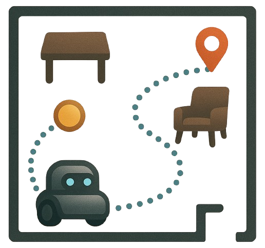
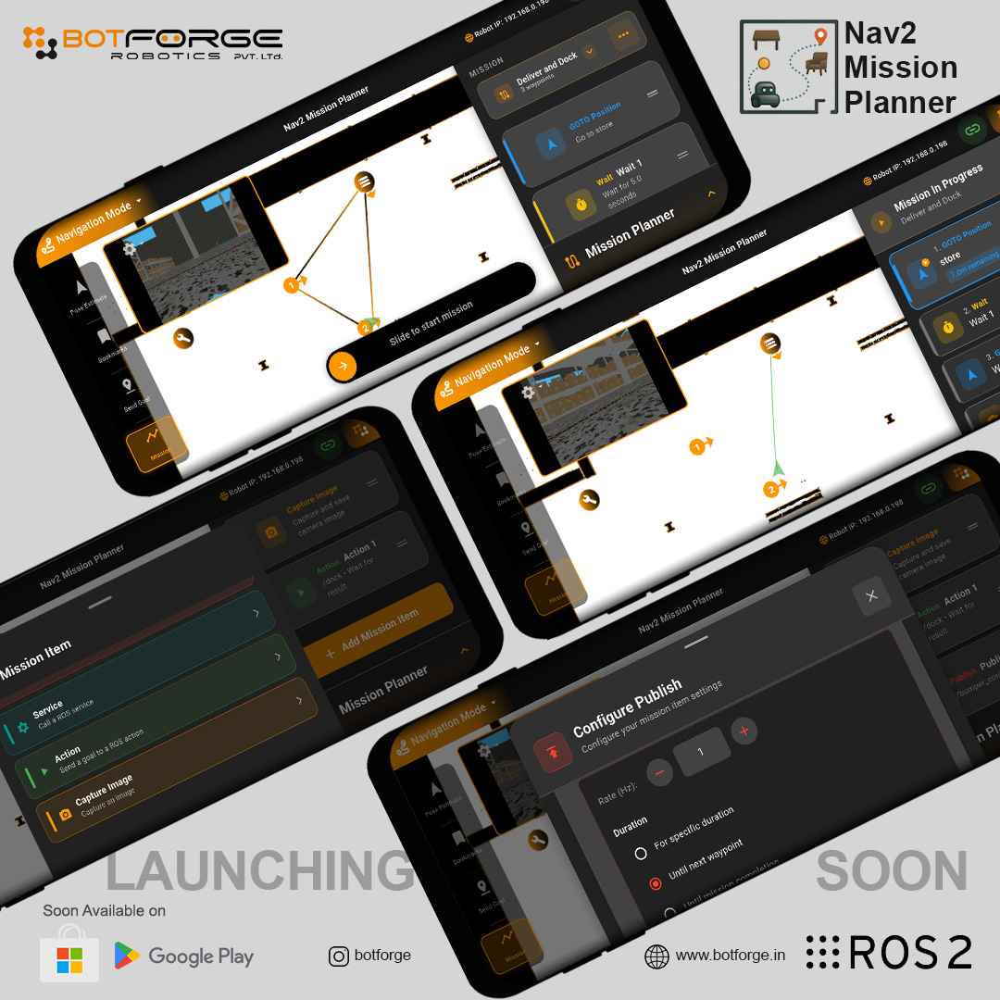
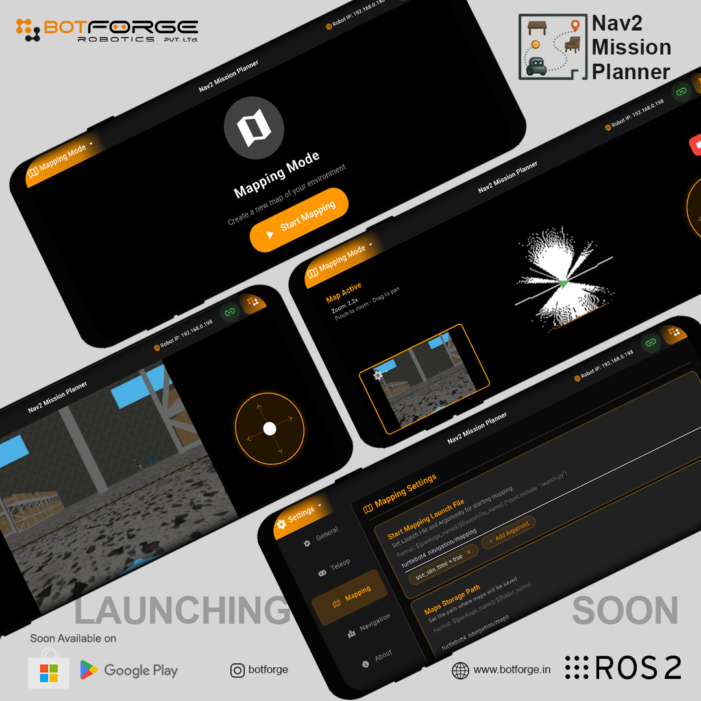
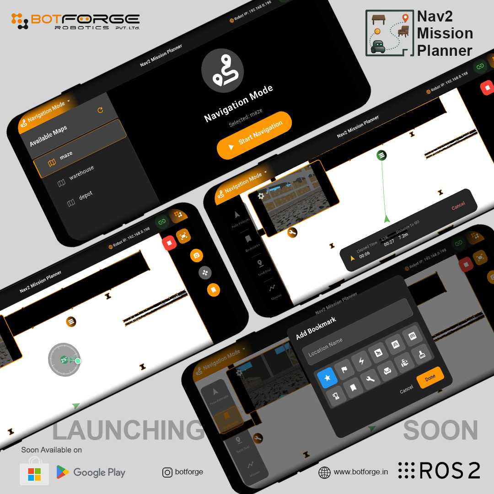

<p align="center">
    
    
    
    
    
    
    
</p>

<div align="center">
  
</div>

<h1 align="center">Nav2 Mission Planner</h1>

## Table of Contents

- [Table of Contents](#table-of-contents)
- [📋 Overview](#-overview)
- [📱 App Showcase](#-app-showcase)
- [📱 Download App](#-download-app)
- [✅ Requirements](#-requirements)
- [⚙️ Configuration](#️-configuration)
  - [📋 Prerequisites](#-prerequisites)
  - [🔧 Required Wrapper Launch Files](#-required-wrapper-launch-files)
- [🚀 Installation](#-installation)
  - [Remove System-Installed Rosbridge Suite](#remove-system-installed-rosbridge-suite)
  - [Install Nav2 Mission Planner](#install-nav2-mission-planner)
  - [Permanent Workspace Setup](#permanent-workspace-setup)
  - [Install Mission Planner App](#install-mission-planner-app)
- [📷 Camera Configuration](#-camera-configuration)
  - [Configure Camera Topic](#configure-camera-topic)
- [📄 License](#-license)

---

## 📋 Overview

Companion package for Nav2 Mission Planner App.

---

## 📱 App Showcase

<p align="center">
  <a href="./images/mockup1.jpg">
    
  </a>
  <a href="./images/mockup2.jpg">
    
  </a>
</p>
<p align="center">
  <a href="./images/mockup3.jpg">
    
  </a>
</p>

---

## 📱 Download App

<div align="center">
  <a href="https://play.google.com/store/apps/details?id=com.botforge.nav2missionplanner">
    
  </a>
</div>

**Download Nav2 Mission Planner for Android:**

- 🚀 **Google Play Store**: [Download Now](https://play.google.com/store/apps/details?id=com.botforge.nav2missionplanner)
- 📱 **Compatible with**: Android 5.0+ (API level 21+)
- 🔧 **Features**: ROS 2 Mapping, Navigation, Mission Planning, Teleoperation
- 🌐 **Support**: [Email](mailto:reachus@botforge.in)

---

## ✅ Requirements

1. Robot with nav2 stack(Ros2 Jazzy or later) which is already able to navigate.
2. Nav2 Mission Planner App

---

## ⚙️ Configuration

### 📋 Prerequisites

1. Your robot is powered on and all **sensor drivers** are running.
2. Your robot has the Nav2 stack installed and configured with your robot-specific navigation parameters, and can navigate to goal poses using RViz

### 🔧 Required Wrapper Launch Files

<details open>
<summary><b>Launch File Requirements</b></summary>
<br>

To switch between mapping and localization modes, you need **two** minimal wrapper launch files in any ROS 2 package:

| Launch file            | Role           | Implementation Details                                                                                 |
| ---------------------- | -------------- | ------------------------------------------------------------------------------------------------------ |
| `mapping_launch.py`    | Mapping / SLAM | Wrapper that launches `nav2_bringup` navigation stack + `slam_toolbox` with sync/async mode options    |
| `navigation_launch.py` | Localization   | Wrapper that launches `nav2_bringup` navigation stack + localization with map file and AMCL parameters |

> **⚠️ Important:** For the `navigation_launch.py` file, the app will pass only the map name (e.g., `office.yaml`). Your launch file must construct the full path to the map file, typically using `PathJoinSubstitution` like:
>
> ```python
> 'map': PathJoinSubstitution([pkg_robot_navigation, 'maps', LaunchConfiguration('map')])
> ```
>
> See the example localization launch file below for a complete implementation.

> **💡 Note:** The Mission Planner app can pass custom parameters to these launch files (e.g., map paths, use_sim_time, etc.) via the LaunchWithArgs service. Make sure your launch files accept the parameters you want to configure from the app.

</details>

<details>
<summary><b>Example — Mapping Launch File</b></summary>
<br>

Example — start mapping:

```python
# mapping_launch.py - Example template

from ament_index_python.packages import get_package_share_directory
from launch import LaunchDescription
from launch.actions import (
    DeclareLaunchArgument,
    GroupAction,
    IncludeLaunchDescription,
    OpaqueFunction
)
from launch.conditions import IfCondition, UnlessCondition
from launch.launch_description_sources import PythonLaunchDescriptionSource
from launch.substitutions import LaunchConfiguration, PathJoinSubstitution
from launch_ros.actions import PushRosNamespace, SetRemap

ARGUMENTS = [
    DeclareLaunchArgument('use_sim_time', default_value='false',
                          choices=['true', 'false'],
                          description='Use sim time'),
    DeclareLaunchArgument('sync', default_value='true',
                          choices=['true', 'false'],
                          description='Use synchronous SLAM'),
    DeclareLaunchArgument('autostart', default_value='true',
                          choices=['true', 'false'],
                          description='Automatically startup the slamtoolbox. Ignored when use_lifecycle_manager is true.'),
    DeclareLaunchArgument('use_lifecycle_manager', default_value='false',
                          choices=['true', 'false'],
                          description='Enable bond connection during node activation'),
    DeclareLaunchArgument('slam_params_file',
                          default_value=PathJoinSubstitution([
                              get_package_share_directory('<robot_package_name_contains_config>'),
                              'config',
                              'slam.yaml'
                          ]),
                          description='Path to the SLAM Toolbox configuration file'),
    DeclareLaunchArgument('nav2_params_file',
                          default_value=PathJoinSubstitution([
                              get_package_share_directory('<robot_package_name_contains_config>'),
                              'config',
                              'nav2.yaml'
                          ]),
                          description='Path to the Nav2 navigation parameters file')
]


def launch_setup(context, *args, **kwargs):
    # Get launch configurations
    sync = LaunchConfiguration('sync')
    use_sim_time = LaunchConfiguration('use_sim_time')
    autostart = LaunchConfiguration('autostart')
    use_lifecycle_manager = LaunchConfiguration('use_lifecycle_manager')
    slam_params = LaunchConfiguration('slam_params_file')
    nav2_params = LaunchConfiguration('nav2_params_file')

    # Get package paths
    pkg_slam_toolbox = get_package_share_directory('slam_toolbox')
    pkg_nav2_bringup = get_package_share_directory('nav2_bringup')

    # Get SLAM launch paths
    launch_slam_sync = PathJoinSubstitution(
        [pkg_slam_toolbox, 'launch', 'online_sync_launch.py'])

    launch_slam_async = PathJoinSubstitution(
        [pkg_slam_toolbox, 'launch', 'online_async_launch.py'])

    # Get Nav2 navigation launch path
    launch_nav2 = PathJoinSubstitution(
        [pkg_nav2_bringup, 'launch', 'navigation_launch.py'])

    # Launch Nav2
    nav2 = IncludeLaunchDescription(
        PythonLaunchDescriptionSource(launch_nav2),
        launch_arguments=[
            ('use_sim_time', use_sim_time),
            ('params_file', nav2_params.perform(context)),
            ('autostart', autostart)
        ]
    )

    # Launch synchronous SLAM if sync=true
    slam_sync = IncludeLaunchDescription(
        PythonLaunchDescriptionSource(launch_slam_sync),
        launch_arguments=[
            ('use_sim_time', use_sim_time),
            ('autostart', autostart),
            ('use_lifecycle_manager', use_lifecycle_manager),
            ('slam_params_file', slam_params.perform(context))
        ],
        condition=IfCondition(sync)
    )

    # Launch asynchronous SLAM if sync=false
    slam_async = IncludeLaunchDescription(
        PythonLaunchDescriptionSource(launch_slam_async),
        launch_arguments=[
            ('use_sim_time', use_sim_time),
            ('autostart', autostart),
            ('use_lifecycle_manager', use_lifecycle_manager),
            ('slam_params_file', slam_params.perform(context))
        ],
        condition=UnlessCondition(sync)
    )

    return [nav2, slam_sync, slam_async]


def generate_launch_description():
    ld = LaunchDescription(ARGUMENTS)
    ld.add_action(OpaqueFunction(function=launch_setup))
    return ld
```

> **Note:**
> In the example code above, replace `<robot_package_name_contains_config>` with the actual name of your robot's package that contains the configuration files (e.g., `ninjabot_mapping`).
> For example:
>
> ```python
> default_value=PathJoinSubstitution([
>     get_package_share_directory('my_robot_bringup'),
>     'config',
>     'nav2.yaml'
> ])
> ```

</details>

<details>
<summary><b>Example — Navigation Launch File</b></summary>
<br>

Example — start localization with a map:

```python
# navigation_launch.py - Example template


from ament_index_python.packages import get_package_share_directory
from launch import LaunchDescription
from launch.actions import (
    DeclareLaunchArgument,
    IncludeLaunchDescription,
    OpaqueFunction
)
from launch.launch_description_sources import PythonLaunchDescriptionSource
from launch.substitutions import LaunchConfiguration, PathJoinSubstitution

# Launch Arguments
ARGUMENTS = [
    DeclareLaunchArgument('use_sim_time', default_value='false',
                          choices=['true', 'false'],
                          description='Use sim time'),

    DeclareLaunchArgument('nav2_params_file',
                          default_value=PathJoinSubstitution([
                              get_package_share_directory('<robot_package_name_contains_config'),
                              'config',
                              'nav2.yaml'
                          ]),
                          description='Nav2 parameters'),

    DeclareLaunchArgument('localization_params_file',
                          default_value=PathJoinSubstitution([
                              get_package_share_directory('<robot_package_name_contains_config>'),
                              'config',
                              'localization.yaml'
                          ]),
                          description='Localization parameters'),

    DeclareLaunchArgument('autostart', default_value='true',
                          choices=['true', 'false'],
                          description='Automatically startup the nav2 stack'),

    DeclareLaunchArgument('map', default_value='warehouse.yaml',
                          description='Full path to map yaml file to load')
]


def launch_setup(context, *args, **kwargs):
    # Get launch configurations
    use_sim_time = LaunchConfiguration('use_sim_time')
    autostart = LaunchConfiguration('autostart')
    nav2_params = LaunchConfiguration('nav2_params_file')
    localization_params = LaunchConfiguration('localization_params_file')
    map_name = LaunchConfiguration('map')
    map_file = PathJoinSubstitution([
        get_package_share_directory('<robot_package_name_contains_maps>'),
        'maps',
        map_name
    ])

    pkg_nav2_bringup = get_package_share_directory('nav2_bringup')

    # Get Nav2 navigation launch path
    launch_nav2 = PathJoinSubstitution(
        [pkg_nav2_bringup, 'launch', 'navigation_launch.py'])

    launch_localization = PathJoinSubstitution(
        [pkg_nav2_bringup, 'launch', 'localization_launch.py'])

    # Launch Nav2
    nav2 = IncludeLaunchDescription(
        PythonLaunchDescriptionSource(launch_nav2),
        launch_arguments=[
            ('use_sim_time', use_sim_time),
            ('params_file', nav2_params.perform(context)),
            ('autostart', autostart)
        ]
    )

    # Launch Localization
    localization = IncludeLaunchDescription(
        PythonLaunchDescriptionSource(launch_localization),
        launch_arguments=[
            ('use_sim_time', use_sim_time),
            ('params_file', localization_params),
            ('map', map_file)
        ]
    )

    return [nav2, localization]


def generate_launch_description():
    ld = LaunchDescription(ARGUMENTS)
    ld.add_action(OpaqueFunction(function=launch_setup))
    return ld
```

> **Note:**
> In the example code above, replace `<robot_package_name_contains_config>` with the actual name of your robot's package that contains the configuration files (e.g., `ninjabot_navigation`).
> Similarly, replace `<robot_package_name_contains_maps>` with the name of your robot's package that contains the map files.
>
> For example, for configuration files:
>
> ```python
> default_value=PathJoinSubstitution([
>     get_package_share_directory('my_robot_bringup'),
>     'config',
>     'nav2.yaml'
> ])
> ```
>
> And for map files:
>
> ```python
> map_file = PathJoinSubstitution([
>     get_package_share_directory('my_robot_bringup'),
>     'maps',
>     map_name
> ])
> ```

</details>

---

## 🚀 Installation

### Remove System-Installed Rosbridge Suite

First, remove any system-installed rosbridge suite packages:

```bash
sudo apt remove ros-jazzy-rosbridge* ros-jazzy-rosapi*
```

### Install Nav2 Mission Planner

```bash
# create workspace and setup
mkdir -p ~/nav2_mission_planner_ws/src
cd ~/nav2_mission_planner_ws/src

# clone the nav2 mission planner repository
git clone https://github.com/botforge-robotics/nav2_mission_planner.git

# clone the custom rosbridge suite fork
git clone https://github.com/botforge-robotics/rosbridge_suite.git

cd ..
# install dependencies (rosdep is recommended)
rosdep install --from-paths src -i -y
# build
colcon build
source install/setup.bash
```

### Permanent Workspace Setup

To permanently add the workspace to your environment, add the following line to your `~/.bashrc`:

```bash
echo "source ~/nav2_mission_ws/install/setup.bash" >> ~/.bashrc
source ~/.bashrc
```

### Install Mission Planner App

1. Download the Mission Planner app from the [Google Play Store](https://play.google.com/store/apps/details?id=com.botforge.nav2missionplanner)
2. Install the app on your Android device
3. Connect your device to the same network as your robot
4. Open the app and follow the on-screen instructions to connect to your robot

---

## 📷 Camera Configuration

After installation, you can configure the camera image topic for the app to display your robot's camera feed, or run without camera functionality.

### Configure Camera Topic

1. **Identify your camera's raw image topic** (e.g., `/camera/image_raw`, `/oakd/rgb/preview/image_raw`, `/turtlebot4_camera/image_raw`)

2. **Launch with your camera topic:**

   ```bash
   ros2 launch nav2_mission_planner nav2_mission_planner.launch.py camera_topic:=/your_camera/raw_image_topic
   ```

3. **Launch without camera topic:**

   ```bash
   ros2 launch nav2_mission_planner nav2_mission_planner.launch.py
   ```

4. **In the app, select the compressed image topic:** `/out/compressed`

---

## 📄 License

This project is licensed under the MIT License – see the [LICENSE](LICENSE) file for details.
